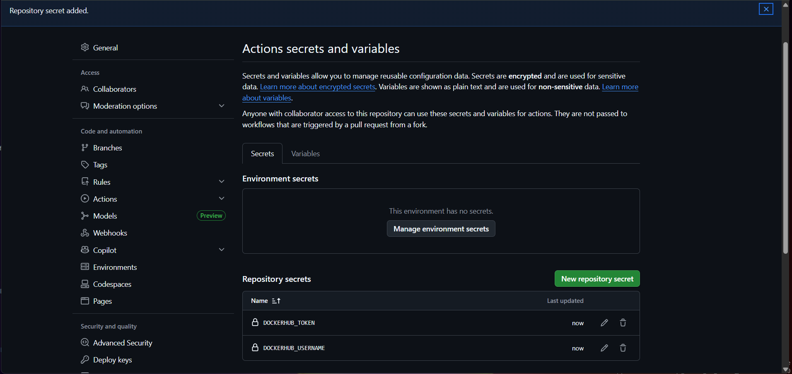
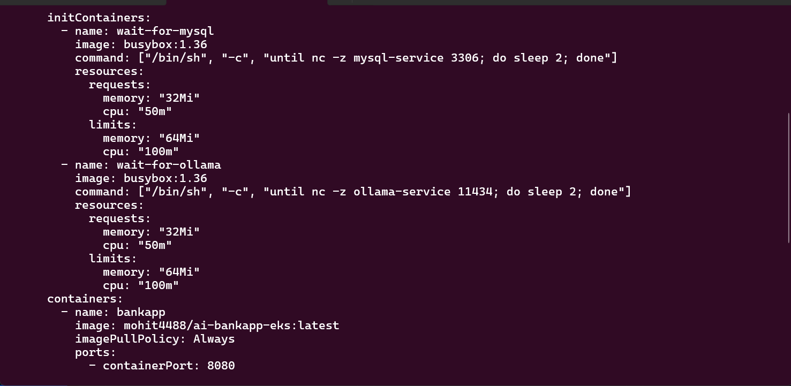
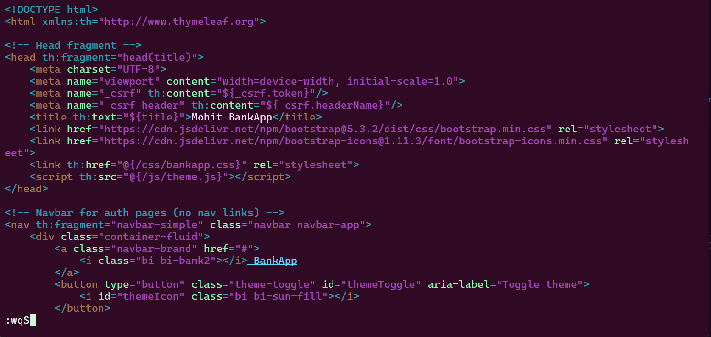

Task 2:-





Task 3:-



[Developer writes code]
    |
[Git push to GitHub]  ........... Day 22-28: Git & GitHub
    |
[GitHub Actions CI]   ........... Day 40-49: GitHub Actions
    |-- Build with Maven
    |-- Run tests
    |-- Build Docker image  ..... Day 29-37: Docker
    |-- Push to DockerHub
    |-- Update K8s manifest
    |-- Commit back to Git
    |
[ArgoCD detects change] ........ Day 84-86: GitOps
    |
[ArgoCD syncs to EKS]  ........ Day 81-83: EKS
    |-- Rolling update
    |-- Health checks pass
    |-- HPA scales as needed ... Day 78-80: Helm (HPA, values)
    |
[Prometheus scrapes metrics] ... Day 73-77: Observability
    |-- Grafana dashboards
    |-- Alerts if something breaks
    |
[App is live with zero downtime]
```

Every block in this challenge connects to the next. This is what a DevOps pipeline looks like in production.

