Task 1:-

What Is an AI Agent?
An AI agent is:
An LLM that can use tools to interact with the real world.

Unlike a normal chatbot:
chatbots only generate text

agents can:
execute commands
inspect systems
call APIs
read logs
take actions

Chatbot vs AI Agent
Feature	                     Chatbot	          AI Agent
Generates text	             Yes	              Yes
Uses tools	                 No	                  Yes
Runs CLI commands	         No 	              Yes
Reads logs/files	         No	                  Yes
Makes decisions	             Limited	          Yes
Autonomous workflows	     No	                  Yes

Why AI Agents for DevOps?
DevOps workflows are heavily tool-based:
docker
kubectl
terraform
ansible
gh
aws

AI agents wrap these CLIs as tools.
The LLM:
reasons about the problem
selects the correct tool
interprets the output
decides the next step
Example — Kubernetes Troubleshooting
User:
"Why is my pod crashing?"
Agent workflow:
THINK:
I should inspect the pods

ACT:
kubectl get pods

OBSERVE:
CrashLoopBackOff

THINK:
I should inspect logs

ACT:
kubectl logs pod-name

OBSERVE:
Database connection failure

ANSWER:
The pod crashes because it cannot connect to MySQL.
This is autonomous infrastructure troubleshooting.

The ReAct Pattern
ReAct means:
Reason + Act

The agent repeatedly:
reasons
selects a tool
executes it
observes output
reasons again

until it has enough information.

ReAct Example — broken-app

User question:
Why is broken-app crashing?
Step 1 — Reason
I should check running containers

Step 2 — Act
Agent calls:
list_containers()

which internally runs:
docker ps -a

Step 3 — Observe
Agent sees:
broken-app   Restarting (1)

Step 4 — Reason Again
I should inspect logs

Step 5 — Act
get_logs("broken-app")

Internally:
docker logs broken-app
Step 6 — Observe
app starting...
exit code 1
Step 7 — Final Answer
The container crashes because its startup command exits
with code 1 after 2 seconds.

The important part:
the LLM decided the workflow itself
no hardcoded troubleshooting logic existed
Key Components of the Agent
Component	Purpose
LLM	Brain
Tools	Hands
LangChain	Agent framework
Ollama	Local LLM runtime
ReAct loop	Reasoning engine

Task 2:-

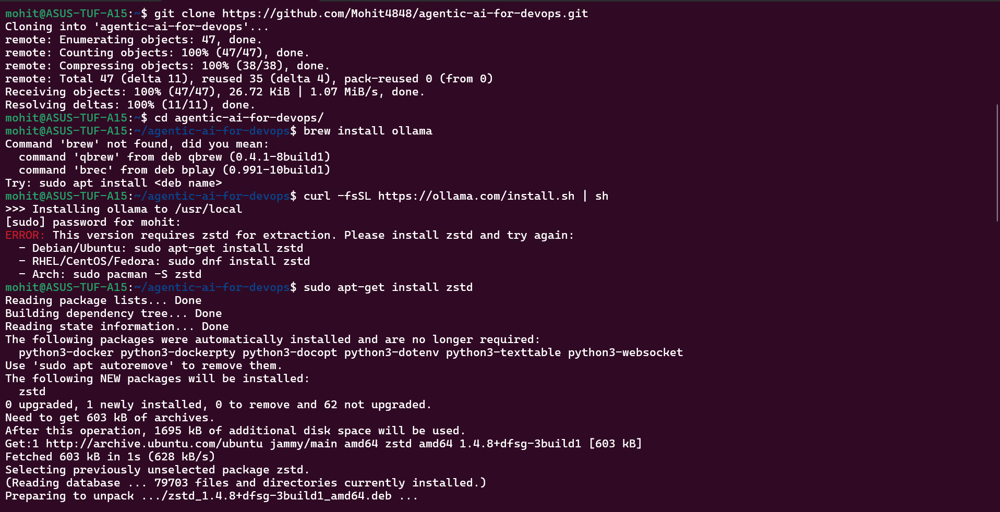

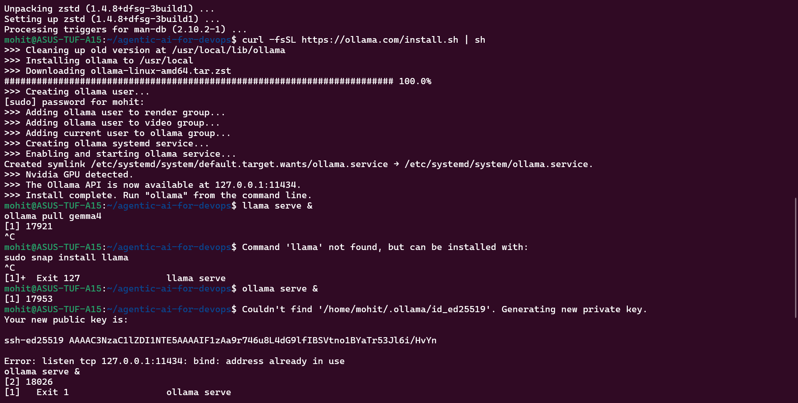

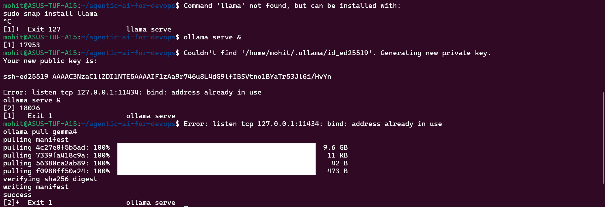

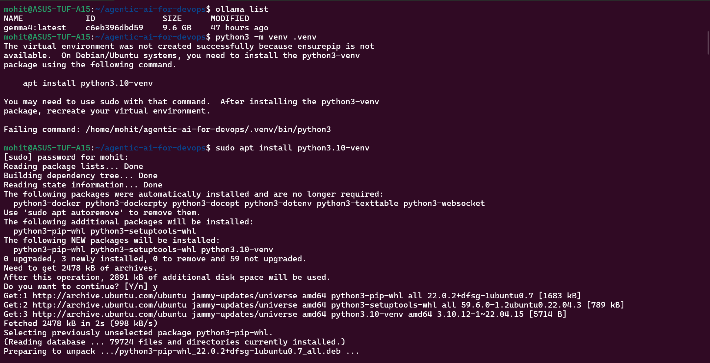

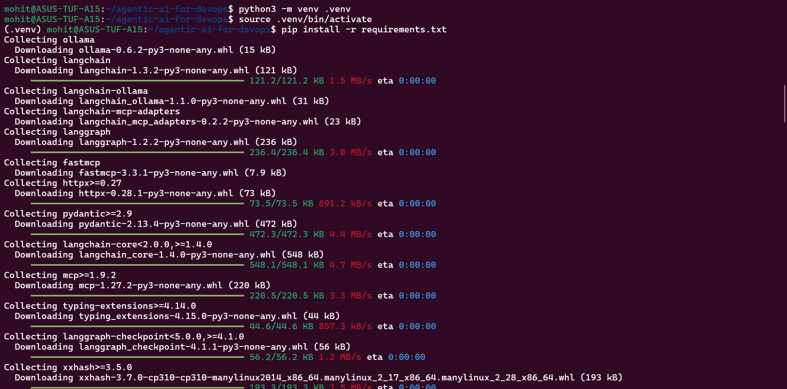

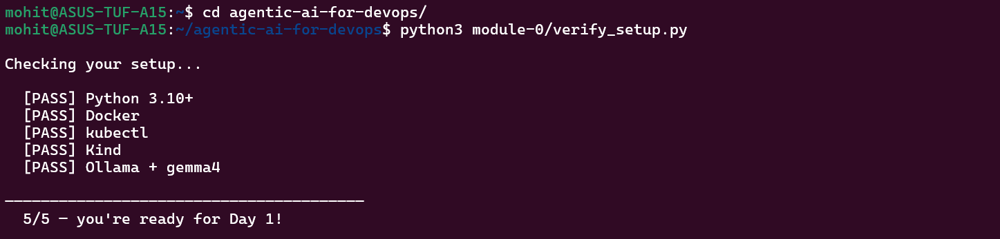

Task 3:-

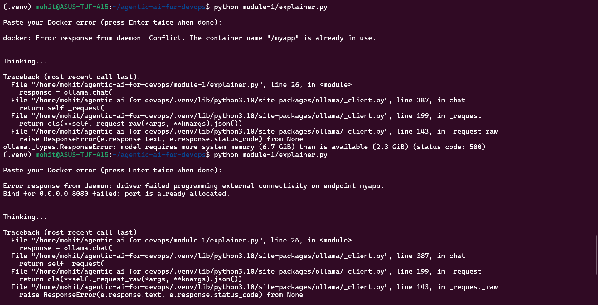

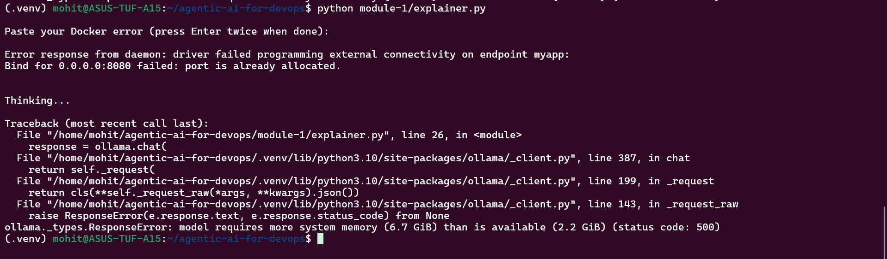

Task 4:-

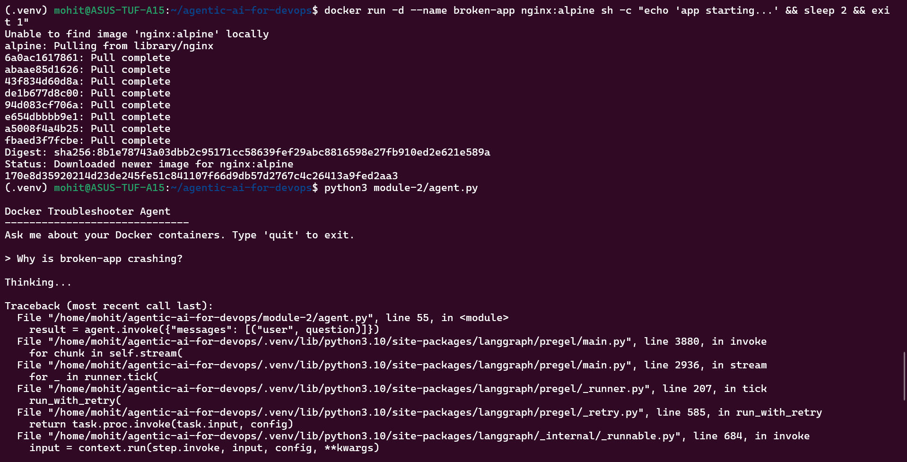

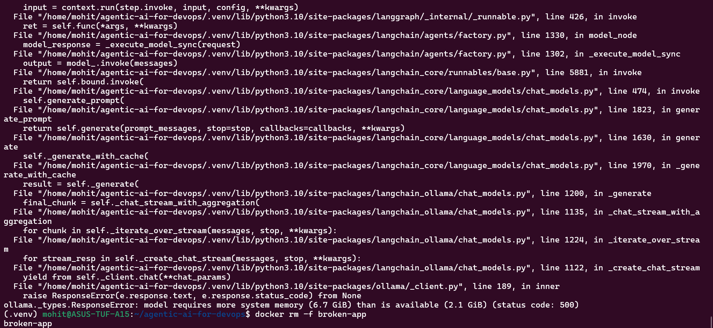

Task 5:-

[User Question]
      |
      v
[LLM: Gemma 4 via Ollama]
      |
      | (ReAct: Reason what tool to use)
      v
[Tool Selection]
      |
      +---> list_containers()   --> docker ps -a
      +---> get_logs()          --> docker logs
      +---> inspect_container() --> docker inspect
      |
      v
[Tool Output (text)]
      |
      v
[LLM reads output, reasons again]
      |
      | (repeat until answer is ready)
      v
[Final Answer to User]

Task 6:-

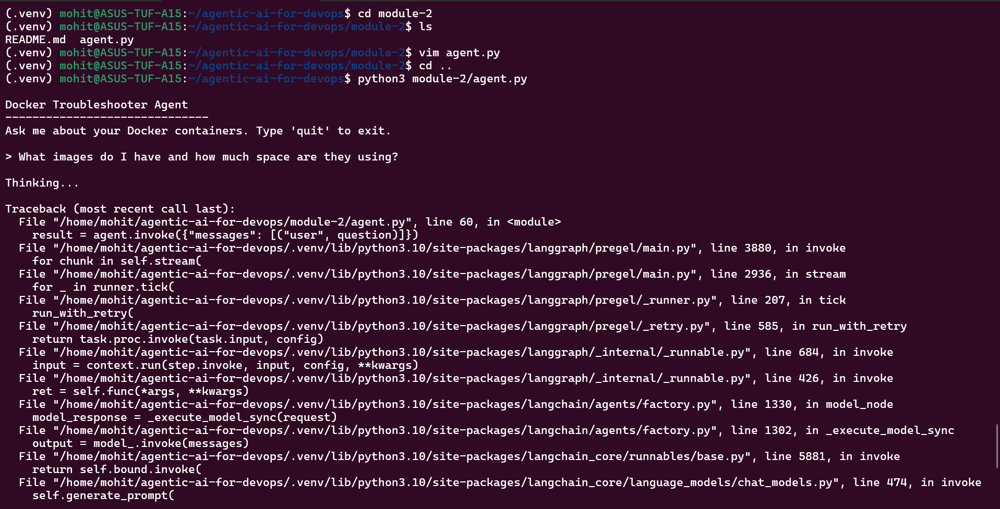

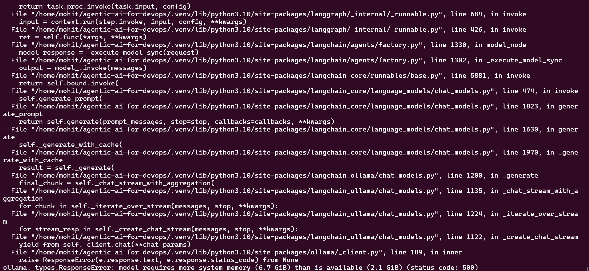